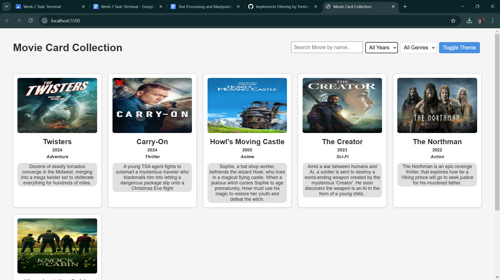
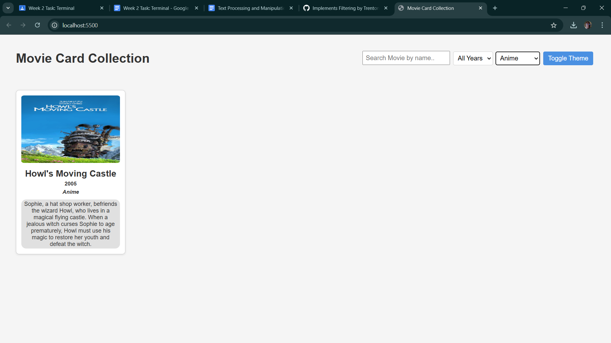
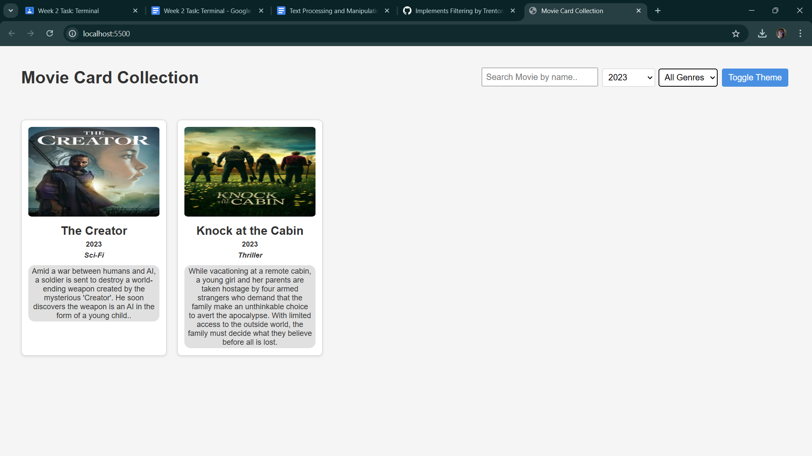

# Movie Collection Web App

A responsive web application for browsing and filtering movies from a curated collection. Built with pure HTML, CSS, and JavaScript.






## Contents
- [Project Setup](#project-setup)
- [Git Workflow](#git-workflow)
- [Features & Implementation](#features--implementation)
- [Team Contributions](#team-contributions)
- [Lessons Learned](#lessons-learned)
- [Technologies Used](#technologies-used)

---

## Project Setup

### Prerequisites
- A modern web browser (Chrome, Firefox, etc.)
- A code editor (VS Code recommended)
- Git (for cloning the repository)

### Installation
1. Clone the repository:
   ```bash
   git clone https://github.com/your-username/movie-collection-web-app.git

2. Open the project folder in your code editor.

3. Run the app:

    - Use a live server extension (e.g., VS Code's Live Server).

    - Right-click index.html and select "Open with Live Server".

## Git Workflow
1. Branching: Create feature branches for new work:
    ```bash
    git checkout -b feature/(new-feature)

2. Commits: Write descriptive commit messages:
    ```bash
    git commit -m "feat: Add (new functionality)"

3. Pull Requests:

    - Push branches to remote: 
    ```bash
    git push origin branch-name

    - Create PRs for code review before merging into main.

4. Syncing: 
    - Regularly pull upstream changes:
    ```bash
    git pull origin main

## Features & Implementation

### Key Features

| Feature                | Implementation Details                                                                 |
|------------------------|---------------------------------------------------------------------------------------|
| **Search by Name**     | `input` event listener on the search box triggers real-time filtering (see `card.js`) |
| **Year/Genre Filters** | Dynamic dropdowns populated from movie data. Combined filter logic in `renderCards()` |
| **Responsive Design**  | CSS Grid and media queries for mobile-first layout (see `style.css`)                  |

## Code Structure

### Code Structure
- `index.html`: Base structure with search/filter UI components.
- `style.css`: Responsive grid, card animations, and theme styles.
- `app.js`: Initializes the app, handles theme toggling, and loads sample data.
- `card.js`: Renders movie cards and implements filter/search logic.
- `movies.json`: Sample movie data (currently loaded as a static array in `app.js`).

## Team Contributions

### Team Members

1. **Tiwalade Adegoke (https://github.com/TrentonFunt)**:  
   - Implemented year/genre filter dropdowns and dynamic population.  
   - Collaborated on responsive CSS and HTML structure.  
   - Integrated theme toggle functionality.  

2. **Princess OKoli (https://github.com/PriincessOkoli)**:  
   - Built the real-time search feature with input event listeners.  
   - Contributed to CSS styling for cards and media queries.  
   - Assisted with HTML templating for movie cards.  

### Shared Work  
- **HTML/CSS**: Jointly refined layouts and styling.  
- **Bug Fixes**: Collaborated on cross-browser testing and edge cases.  

---

## Lessons Learned  

### Collaboration Insights  
- **Git Practices**: Regular communication prevented merge conflicts. PR reviews improved code quality.  
- **Modular Code**: Separating `card.js` and `app.js` allowed parallel development.  
- **Responsive Design**: Media queries required joint testing across devices.  
- **Feature Integration**: Combining search + filter logic highlighted the value of clear function boundaries.  

---

## Technologies Used  
- **Frontend**: HTML5, CSS3, Vanilla JavaScript  
- **Data**: JSON for movie storage *(planned future implementation)*  
- **Tools**: Git, VS Code, Live Server  
